# 🛡️ 个人博客系统渗透测试报告

---

## 📋 项目信息

| 项目 | 内容 |
|:--|:--|
| **项目名称** | 个人博客系统 |
| **测试代号** | `Calm Halo T` |
| **测试时间** | 2026-05-24 14:36 – 17:27 EDT |
| **测试人员** | 本博客系统开发者&openclaw|
| **授权范围** | 实验环境 · 不修改数据 · 不中断服务 · 不破坏系统 |

---

## 一、🔍 测试背景与目标

### 1.1 项目背景

该个人博客系统基于 **React 19 + TypeScript + Vite** 构建前端，后端采用自建 **Node.js + Express + SQLite** 架构（原基于腾讯云开发 CloudBase 构建，后完成架构迁移）。核心功能涵盖文章管理、评论互动、文件分享、用户认证及 AI 智能等模块。

本次测试旨在发现系统潜在安全漏洞，验证安全防护有效性，提升系统整体安全性。

### 1.2 测试目标

| 维度 | 描述 |
|:--|:--|
| **目标资产** | 一台windows10 主机，部署此个人博客系统 |
| **核心方向** | 权限控制 · 数据防护 · 接口安全 · 文件处理 |
| **预期产出** | 识别并验证高危漏洞 · 输出可落地修复建议 |

### 1.3 目标资产核心信息

| 类别 | 详情 |
|:--|:--|
| 🖥️ **操作系统** | Windows（VMware 虚拟机） |
| 🌐 **Web 服务** | Express (Node.js) + React SPA (Vite) |
| 🔌 **开放端口** | **3000**（HTTP）— 其余端口受 Windows 防火墙过滤 |
| 🗄️ **数据库** | MongoDB（`_id` 为 UUID 格式） |
| ⚛️ **前端技术栈** | React 19.2.6 · React Router DOM 6.30.3 · DOMPurify 3.4.5 |
| 🔑 **认证机制** | JWT（Bearer token，存储于 `localStorage`） |
| 🛠️ **后端技术栈** | Node.js + Express · SQLite（better-sqlite3）· JWT + bcrypt 认证 |

---

## 二、📐 测试方法论


本次测试基于 **MITRE ATT&CK** 框架，结合 **OWASP Top 10** 安全风险维度，采用 **「信息收集 → 漏洞探测 → 漏洞验证 → 攻击链分析 → 安全验证」** 的渗透测试流程，使用 OpenClaw 工具配合 `cybersecurity‑skills` 安全技能库完成全流程测试。

---

## 三、⚠️ 漏洞发现与验证

### 3.1 🔴 高危漏洞

#### 3.1.1 IDOR 水平越权（修改文章）

| 项目 | 内容 |
|:--|:--|
| **漏洞标识** | `CWE-639` · `MITRE T1068`（权限提升） |
| **风险等级** | 🔴 **高危** |
| **CVSS 3.x** | 7.5 (AV:N/AC:L/PR:L/UI:N/S:U/C:N/I:H/A:N) |

**漏洞详情**

`PUT /api/articles/:id` 接口**未校验文章所有权**，未验证请求用户 `req.user.uid` 与文章作者 `article.authorId` 是否一致。

**验证结果**

```text
测试用户 User1 成功将 User2 发布的文章标题修改为 "HACKED by user1!"
```

**影响范围**

> 任意登录用户可篡改他人文章标题、内容，**严重破坏数据完整性**。

**修复建议**

```javascript
// 在 PUT 路由中添加：
if (article.authorId !== req.user.uid) {
  return res.status(403).json({ 
    success: false, 
    error: "无权修改该文章" 
  });
}
```

---

### 3.2 🟠 中危漏洞

#### 3.2.1 CORS 配置过于宽泛

| 项目 | 内容 |
|:--|:--|
| **漏洞标识** | `MITRE T1189`（驱动器入侵） |
| **风险等级** | 🟠 **中危** |

**漏洞详情**

后端响应头配置 `Access-Control-Allow-Origin: *`，未限制跨域请求来源。

**验证结果**

```http
HTTP/1.1 200 OK
Access-Control-Allow-Origin: *
```

**影响范围**

> 第三方恶意网站可发起跨域请求，读取该系统 API 响应数据，**扩大攻击面**。

**修复建议**

```javascript
app.use(cors({
  origin: ['https://your-frontend-domain.com']
}));
```

---

#### 3.2.2 文件上传无管控 + 存储文件公开访问

| 项目 | 内容 |
|:--|:--|
| **漏洞标识** | `OWASP Top 10 A03:2021`（注入） |
| **风险等级** | 🟠 **中危** |

**漏洞详情**

- `/uploads/` 目录**无访问鉴权**，任意用户可直接通过 HTTP 访问
- 文件上传接口**未限制文件类型**，可上传 `.html` / `.js` / `.ejs` 等危险类型

**验证结果**

```text
✅ 上传包含 XSS 代码的 HTML 文件，访问后 JS 代码可正常执行
```

**影响范围**

> 可通过上传恶意文件实施 XSS、代码执行等攻击，泄露服务器文件。

**修复建议**

```javascript
// 1. 文件上传类型白名单
const upload = multer({
  fileFilter: (req, file, cb) => {
    const allowed = ['.jpg', '.png', '.pdf', '.doc'];
    const ext = path.extname(file.originalname).toLowerCase();
    allowed.includes(ext) ? cb(null, true) : cb(new Error('不允许的文件类型'));
  }
});

// 2. 文件访问改为代理方式
app.get('/api/files/:id/download', authMiddleware, async (req, res) => {
  // 校验权限后返回文件
});
```

---

#### 3.2.3 存储型 XSS（后端未过滤）

| 项目 | 内容 |
|:--|:--|
| **漏洞标识** | `OWASP Top 10 A03:2021`（注入） |
| **风险等级** | 🟠 **中危** |

**漏洞详情**

后端 API 未对文章标题、内容等输入做 HTML 标签过滤，直接存储 `<script>alert(1)</script>` 等恶意代码。虽前端通过 DOMPurify 过滤渲染内容，但**原始 JSON 响应仍包含未转义的恶意标签**。

**验证结果**

```json
{
  "title": "<script>alert(1)</script>",
  "content": ""
}
```

**影响范围**

> 若前端过滤机制失效，将触发**存储型 XSS**，窃取用户信息、劫持会话。

**修复建议**

```javascript
const sanitizeHtml = require('sanitize-html');
// 入库前过滤
article.title = sanitizeHtml(article.title);
article.content = sanitizeHtml(article.content);
```

---

### 3.3 🔵 低危漏洞

#### 3.3.1 文件列表无权限隔离

| 项目 | 内容 |
|:--|:--|
| **风险等级** | 🔵 **低危** |

`GET /api/files` 接口未按用户/角色隔离数据，任意登录用户可查看全系统上传文件列表（含文件名、上传者、文件大小等信息）。

> **影响**：信息泄露，攻击者可收集系统文件信息，为后续攻击铺垫。

---

#### 3.3.2 JWT Token 存储不安全

| 项目 | 内容 |
|:--|:--|
| **风险等级** | 🔵 **低危** |

JWT Token 存储于 `localStorage`，未使用 `HttpOnly Cookie` 存储。

> **影响**：若系统存在 XSS 漏洞，Token 可被直接窃取，导致会话劫持。

---

#### 3.3.3 认证接口无速率限制

| 项目 | 内容 |
|:--|:--|
| **风险等级** | 🔵 **低危** |

`/api/auth/login`、`/api/auth/register` 接口无访问频率限制。

> **影响**：易遭受暴力破解（用户名密码）、批量注册垃圾账号等攻击。

---

## 四、✅ 安全防护措施验证

| 防护措施 | 结果 | 说明 |
|:--|:--:|:--|
| `DELETE /api/articles` 所有权校验 | ✅ 通过 | 接口校验文章所有权，未发现越权删除 |
| 管理员 API 接口保护 | ✅ 通过 | 普通用户无法访问管理员专属接口 |
| NoSQL 注入防护 | ✅ 通过 | JSON 操作符被有效拦截 |
| SQL 注入防护 | ✅ 通过 | 未发现 SQL 注入点 |
| 注册角色覆写防护 | ✅ 通过 | 注册接口忽略 `role` 参数 |
| JWT 敏感信息泄露 | ✅ 通过 | Token 仅含 `uid`、`iat`、`exp` |
| 前端 XSS 过滤 (DOMPurify) | ✅ 通过 | 渲染层有效过滤恶意 HTML |
| 错误信息泄露 | ✅ 通过 | 无堆栈、敏感配置暴露 |

---

## 五、⏱️ 渗透测试时间线

```mermaid
gantt
    title 测试时间线
    dateFormat HH:mm
    axisFormat %H:%M
    
    section 准备阶段
    授权确认           :a1, 04:36, 1min
    信息收集           :a2, 04:37, 1min
    指纹识别           :a3, 04:38, 1min
    
    section 漏洞发现
    API 发现           :b1, 04:39, 2min
    漏洞探测           :b2, 04:41, 9min
    漏洞验证           :b3, 04:51, 8min
    
    section 权限提升
    权限提升尝试       :c1, 05:13, 7min
    调试排查           :c2, 05:21, 4min
    暴力破解           :c3, 05:25, 2min
```



| 时间区间 | 测试阶段 | 核心操作 |
|:--|:--|:--|
| `04:36` | ✅ 授权确认 | 确认测试范围、边界（不修改数据、不中断服务） |
| `04:37` | 👁️ 信息收集 | 网络扫描，定位目标端口 **3000** |
| `04:38` | 🔍 指纹识别 | 识别目标技术栈为 **Express + React** |
| `04:39-04:40` | 🔎 API 发现 | 逆向 JS bundle 文件，提取所有 API 端点 |
| `04:41-04:50` | 🧪 漏洞探测 | 注册测试用户，测试 NoSQLi / SQLi / IDOR / XSS |
| `04:51-05:00` | ✅ 漏洞验证 | 复现 **IDOR 越权**、**存储型 XSS**、**文件上传未授权访问** |
| `05:13-05:20` | 🔼 权限提升尝试 | 利用文件上传 XSS + iframe 投递，尝试提权 |
| `05:21-05:25` | 🔬 调试排查 | 导出 `localStorage`，确认 admin 未通过浏览器登录 |
| `05:25-05:27` | 💥 暴力破解尝试 | 识别 `administrator` 普通用户，未破解 admin 密码 |

---

## 六、🔗 攻击链分析

### 6.1 ✅ 已验证可行攻击链


```
📝 注册普通用户 
→ 📤 上传含 XSS 代码的文件 
→ 🌐 触发同源 XSS 窃取会话 
→ ✏️ 利用 IDOR 修改他人文章
```

### 6.2 ❌ 未成功攻击路径

| 攻击路径 | 失败原因 |
|:--|:--|
| 🔑 XSS → 窃取 admin token → 提权 | admin 未通过浏览器登录，`localStorage` 无有效 Token |
| 🖥️ SSTI → RCE | 模板注入仅存储为字符串，无服务端渲染 |
| 📂 路径穿越 → 读取服务器文件 | Express 静态目录隔离良好 |
| 🌐 封面图 SSRF → 内网扫描 | 封面图仅存元数据，无服务端请求 |
| 🔧 原型污染 → RCE | API 接受 `__proto__`，但无可用利用链 |

---

## 七、🛠️ 修复建议

| 优先级 | 修复项 | 难度 | 具体操作 |
|:--:|:--|:--:|:--|
| 🚨 **立即** | `PUT /api/articles/:id` 所有权校验 | 🟢 低 | 添加 `article.authorId !== req.user.uid` 校验，不一致则返回 `403` |
| ⏰ **尽快** | 限制 CORS 允许的源域名 | 🟢 低 | 改为受信任域名白名单 |
| ⏰ **尽快** | 上传文件目录添加访问鉴权 | 🟢 低 | 静态目录改为代理访问，校验权限 |
| 📋 **计划** | 后端输入 XSS 过滤/转义 | 🟢 低 | 入库前 `sanitize-html` 过滤，API 响应前转义 |
| 📋 **计划** | JWT 改用 `HttpOnly Cookie` | 🟡 中 | 后端设置 `HttpOnly`，前端调整鉴权 |
| 📋 **计划** | 认证接口添加速率限制 | 🟢 低 | `express-rate-limit`：1分钟10次 |
| 📋 **计划** | 文件上传类型白名单 | 🟢 低 | `multer` 配置，仅允许 `jpg/png/pdf` 等 |

---

## 八、🎯 总结

本次渗透测试针对个人博客系统的核心业务流程和技术架构，识别出：

| 等级 | 数量 | 漏洞概况 |
|:--:|:--:|:--|
| 🔴 **高危** | **1** | IDOR 水平越权 — 可篡改任意用户文章 |
| 🟠 **中危** | **3** | CORS 宽泛 · 文件上传无管控 · 存储型 XSS |
| 🔵 **低危** | **3** | 文件列表泄露 · Token 存储 · 无限速 |

验证了系统在**权限控制、跨域防护、文件处理、输入过滤**等维度的安全短板。核心高危漏洞（IDOR 越权）可通过**简单的逻辑校验**快速修复，中低危漏洞需从配置、代码层面逐步优化。

### 📌 后续建议

1. 🚨 **优先修复高危漏洞**，再按优先级完成中低危漏洞整改
2. 🔄 整改后**重新开展渗透测试**，验证修复效果
3. 📅 **建立常态化安全测试机制**，在功能迭代前完成接口权限、输入过滤、文件处理等核心环节的安全校验

---
